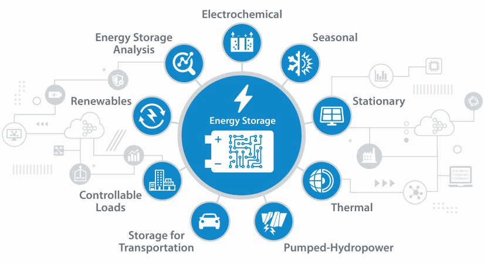

<h1 align="center">👋 Welcome to SESR Group </h1>

  
   

Welcome to the **GitHub Homepage** of the  **Sustainable Energy Storage and Recycling Group** (SESR) led by **Dr.Nikiforidis Georgios** at the **University College London**. 

The Group's mission is to advance the development and implementation of **sustainable energy storage materials and technologies**, focusing on the **circular economy of electric vehicle (EV) batteries**, **Bio-energy production**, and **green electrolyte engineering**.

<!-- GreenEnergy-->

SESR Group is located at the [University College London](https://www.ucl.ac.uk/) East campus (Marshgate) [Institute for Material Discovery](https://www.ucl.ac.uk/institute-for-materials-discovery/about).

For more information take a look at our publications page of [Dr.Nikiforidis Georgios](https://scholar.google.com/citations?user=3D4G2t8AAAAJ&hl=en&oi=ao).
